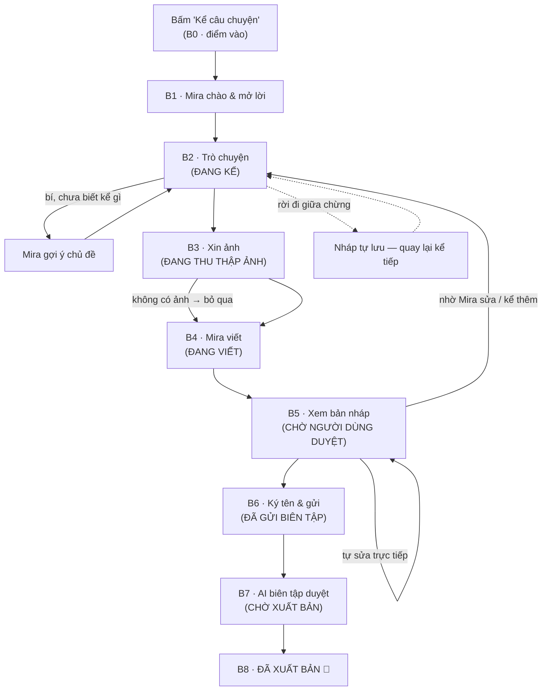

# UX Flow — Hành trình kể chuyện cùng Mira

> Tài liệu thiết kế trải nghiệm. **Chưa phải spec kỹ thuật** — không có database,
> không có API. Đọc cùng `PROJECT_CONTEXT.md`.
>
> ⚖️ **`MIRA_CONSTITUTION.md` đứng trên tài liệu này** (ban hành
> 2026-07-27): Mira lắng nghe là chính, không hỏi liên tục, không gợi ý
> nội dung; UI không được giống chat AI; luôn hiển thị Cuốn sách sống
> (xem thêm `10_Growth_Loop_va_Cuon_sach_song.md`). Mục B2 dưới đây đã
> được viết lại theo hiến pháp.
>
> Phạm vi: từ lúc người dùng bấm **"Kể câu chuyện"** đến lúc câu chuyện
> **được xuất bản** trong thư viện.

------------------------------------------------------------------------

# 1. Nguyên tắc thiết kế

1.  **Người dùng không cần biết viết.** Họ chỉ cần *trò chuyện*. Mira là
    người viết; người dùng là người kể và người quyết định.
2.  **Context thật của người dùng:** "Tôi có kỷ niệm với cây đàn, nhưng
    tôi không biết viết, sợ viết dở, sợ không ai quan tâm." → Mọi bước
    trong luồng đều để tháo 3 nỗi sợ này.
3.  **Một câu hỏi mỗi lần.** Mira không bao giờ hỏi 2 câu cùng lúc,
    không đưa form dài. Cảm giác phải là *ngồi kể chuyện bên ấm trà*,
    không phải *điền hồ sơ*.
4.  **Câu chuyện luôn thuộc về người kể.** Mira viết lại nhưng người
    dùng duyệt từng chữ, sửa được, và chỉ xuất bản khi họ bấm đồng ý.
5.  **Không bao giờ mất bài.** Kể dở → lưu tự động → quay lại kể tiếp
    (tài khoản giúp nháp theo người, đa thiết bị).
6.  **Kể chuyện cần tài khoản** (Văn Anh chốt 2026-07-27): tài khoản
    chính là **tài khoản học sinh sẵn có** của class.vananhaudio.com
    (KHÔNG có hệ tài khoản mới). Vì /story nằm cùng domain, phiên đăng
    nhập Supabase dùng chung — học sinh đang ở trang class chỉ việc
    **click qua là vào thẳng luồng kể, không đăng nhập lại, không thấy
    bất kỳ màn đăng nhập nào**. Người mới (tỉ lệ ít) tạo tài khoản
    trước khi kể — cùng hệ tài khoản, là cầu nối chuyển đổi thành học
    viên sau này. Màn tạo tài khoản phải được đóng khung ấm áp (Mira
    giải thích vì sao), không như một bức tường đăng ký khô khan.

------------------------------------------------------------------------

# 2. Bản đồ hành trình & trạng thái

7 trạng thái của một câu chuyện:

    Đang kể → Đang thu thập ảnh → Đang viết → Chờ người dùng duyệt
            → Đã gửi biên tập → Chờ xuất bản → Đã xuất bản

Vòng lặp quan trọng nhất: **B5 → B2 → B4 → B5** (duyệt → kể thêm/sửa →
viết lại → duyệt) — được lặp bao nhiêu lần tùy người dùng.

------------------------------------------------------------------------

# 3. Chi tiết từng bước

Mỗi bước trả lời 4 câu hỏi: người dùng **nhìn thấy gì** · Mira **nói gì**
· người dùng **cần làm gì** · điều gì khiến họ **muốn tiếp tục**.

## B0 — Điểm vào: bấm "Kể câu chuyện"

-   **Nhìn thấy gì:**
    -   **Đã đăng nhập** (học sinh — trường hợp phổ biến): phiên
        Supabase của class.vananhaudio.com nhận tự động (cùng domain,
        không hỏi đăng nhập lại) → vào thẳng **màn hình trò chuyện**
        toàn màn hình — nền kem ấm như landing, khung chat ở giữa,
        avatar Mira (chấm xanh "đang trực tuyến"). Không form, không
        field nào cả. Mira có thể chào bằng đúng tên học sinh.
    -   **Chưa đăng nhập** (người mới — tỉ lệ ít): một màn nhỏ mang
        giọng Mira, KHÔNG phải bức tường đăng ký:
        > "Trước khi kể, mình cần một chỗ để **giữ câu chuyện của bạn
        > không bị mất** — kể dở hôm nay, mai kể tiếp, và để mình báo
        > tin khi chuyện được đăng. Tạo tài khoản miễn phí chỉ mất
        > 30 giây nhé 🌿"
        Form tối giản (tên, email, mật khẩu — dùng chung tài khoản TVA
        sẵn có) + nút "Đã có tài khoản? Đăng nhập". Xong → vào thẳng B1.
-   **Mira nói gì:** như trên (chỉ với người chưa đăng nhập).
-   **Cần làm gì:** không gì cả (đã đăng nhập) / tạo tài khoản 30 giây.
-   **Vì sao tiếp tục:** lý do xin tài khoản là *vì câu chuyện của họ*
    (không mất bài, được báo tin) — không phải vì hệ thống cần data.
    Với học sinh, bước này vô hình.

## B1 — Mira chào & mở lời

-   **Nhìn thấy gì:** tin nhắn đầu tiên của Mira hiện dần (hiệu ứng gõ
    phím). Bên dưới là ô nhập + 2–3 nút gợi ý nhanh:
    `Mình có chuyện muốn kể` · `Mình chưa biết kể gì` · `Kể chuyện này là sao?`
-   **Mira nói gì:**
    > "Chào bạn, mình là Mira 🌿 Mình đang giúp thầy Văn Anh gom đủ
    > 1001 câu chuyện thật của những người yêu guitar.
    > Bạn không cần biết viết đâu — cứ trò chuyện với mình như một
    > người bạn, phần viết để mình lo.
    > Bạn đã có chuyện muốn kể chưa, hay để mình gợi nhớ giúp?"
-   **Cần làm gì:** bấm một nút gợi ý hoặc gõ tự nhiên.
-   **Vì sao tiếp tục:** lời hứa rõ ràng ngay câu đầu — *"không cần
    biết viết"*; và có lối đi cho cả người chưa biết kể gì.

## B2 — Kể chuyện (trạng thái: ĐANG KỂ) — *viết lại theo MIRA_CONSTITUTION*

Trái tim của toàn bộ trải nghiệm. Đây **không phải chat với AI** —
là một mặt giấy để kể; Mira ngồi nghe bên cạnh.

-   **Nhìn thấy gì:** giao diện tối giản như một **trang giấy đang
    viết dở** — lời kể của người dùng là dòng chảy chính, chiếm trọn
    mặt trang; lời của Mira hiếm hoi, xuất hiện như ghi chú nhỏ nhẹ
    bên lề (chữ nghiêng, mờ hơn), KHÔNG phải bong bóng chat đối đáp.
    Trên đầu trang luôn có dòng Cuốn sách sống:
    `📖 Bạn đang viết một trang cho 1001 Câu chuyện cùng Guitar.`
    Không thanh tiến độ, không điểm, không huy hiệu.
-   **Mira nói gì — CHẾ ĐỘ LẮNG NGHE (mặc định):** người dùng đang kể
    → Mira **chỉ lắng nghe, không hỏi thêm**. Phản hồi tối đa là một
    nhịp gật đầu bằng chữ, thưa thớt: "Mình đang nghe…", "Rồi sao
    nữa?" — hoặc không nói gì.
-   **Mira nói gì — CHẾ ĐỘ KHAI QUẬT (chỉ khi thật sự cần):** kích
    hoạt khi người dùng dừng lâu hoặc nói "em bí" / "không nhớ" /
    "không biết kể gì". Mira dùng **duy nhất câu hỏi mở**, mỗi lần
    một câu:
    > "Bạn nhớ điều gì đầu tiên?" · "Khi đó bạn đang ở đâu?" ·
    > "Người đầu tiên xuất hiện trong ký ức là ai?"

    **Cấm tuyệt đối:** "Có phải…", "Lúc đó bạn rất buồn phải không…",
    "Có đúng là…" — không câu hỏi đóng, không dẫn dắt, **không gieo
    ký ức**, không gợi ý chủ đề/nội dung. Người dùng kể lại được →
    Mira trở về lắng nghe.
-   **Cần làm gì:** kể tự nhiên — gõ ngắn cũng được, sai chính tả
    cũng được, lộn xộn cũng được. Muốn được giúp thì nói "mình bí".
-   **Vì sao tiếp tục:** cảm giác **được nghe thật sự** — không bị
    tra khảo, không bị AI chen ngang; và dòng Cuốn sách sống nhắc họ
    đang viết một trang cho một cuốn sách chung có thật.
-   **Khi nào chuyển bước:** người dùng nói "đủ rồi"/"viết đi", hoặc
    khi chất liệu đã đầy và người dùng đã ngừng kể, Mira đề nghị
    *một lần, nhẹ*: "Mình sắp xếp lại thành một trang nhé?" — người
    dùng gật mới chuyển.

### B2b — Rời đi giữa chừng (nháp tự lưu)

-   **Nhìn thấy gì:** nếu đóng trang, không mất gì. Lần sau quay lại
    `/story` sẽ thấy: `📝 Bạn có một câu chuyện đang kể dở — kể tiếp?`
-   **Mira nói gì (khi quay lại):**
    > "Mừng bạn quay lại 🌿 Lần trước mình dừng ở đoạn cây đàn bị gãy
    > cần… Bạn kể tiếp cho mình nghe chứ?"
-   **Vì sao tiếp tục:** Mira *nhớ* câu chuyện — cảm giác được chờ đợi.

## B3 — Xin ảnh (trạng thái: ĐANG THU THẬP ẢNH)

-   **Nhìn thấy gì:** vẫn trong khung chat, xuất hiện nút
    `📷 Chọn ảnh` và nút `Mình không có ảnh — bỏ qua`.
-   **Mira nói gì:**
    > "Câu chuyện có ảnh sẽ sống động hơn nhiều. Bạn có tấm nào về cây
    > đàn, về bạn hồi đó, hay một khoảnh khắc trong chuyện không?
    > 1–3 tấm là đẹp. Không có cũng không sao — chữ của bạn đã đủ
    > chạm rồi."
-   **Cần làm gì:** chọn 1–3 ảnh từ máy, hoặc bỏ qua. Với mỗi ảnh, Mira
    hỏi một câu ngắn: "Tấm này chụp lúc nào vậy?" → thành chú thích ảnh.
-   **Vì sao tiếp tục:** ảnh là của họ, gợi thêm ký ức; và **bỏ qua
    không bị phạt** — Mira khen phần chữ để không ai thấy thiếu.

## B4 — Mira viết (trạng thái: ĐANG VIẾT)

-   **Nhìn thấy gì:** màn chờ ấm áp thay vì spinner khô khan: biểu
    tượng cây bút + dòng chữ thay đổi: *"Mira đang đọc lại cuộc trò
    chuyện…"* → *"Đang chọn chi tiết đắt nhất…"* → *"Đang viết những
    dòng đầu…"* (khoảng 15–40 giây).
-   **Mira nói gì (trước khi viết):**
    > "Mình đủ chất liệu rồi. Giờ mình viết lại thành một bài hoàn
    > chỉnh nhé — mình sẽ giữ đúng giọng của bạn, không thêm thắt gì
    > không có thật. Chờ mình một chút ⏳"
-   **Cần làm gì:** chờ (ngắn). Không rời được cảm giác "sắp được đọc
    chuyện của chính mình".
-   **Vì sao tiếp tục:** tò mò đỉnh điểm — *chuyện mình kể lộn xộn mà
    thành bài văn thì trông thế nào?* Đây là khoảnh khắc "wow" của cả
    luồng.
-   **Nguyên tắc bài viết của Mira:** ngôi thứ nhất, đúng giọng người
    kể (mộc mạc giữ mộc mạc), **chỉ dùng chi tiết có thật** từ cuộc trò
    chuyện, 400–700 chữ, có tiêu đề gợi ý + chủ đề gắn sẵn.

## B5 — Xem bản nháp (trạng thái: CHỜ NGƯỜI DÙNG DUYỆT)

-   **Nhìn thấy gì:** bản nháp hiển thị **đúng như một bài đã xuất bản**
    (đúng layout trang chi tiết câu chuyện: ảnh, chủ đề, tiêu đề, nội
    dung) — kèm nhãn `BẢN NHÁP — chỉ mình bạn thấy`. Dưới bài là 3 nút:
    -   `💚 Mình ưng rồi` → sang B6
    -   `✏️ Tự sửa` → nội dung thành ô soạn thảo, sửa trực tiếp từng chữ
    -   `💬 Nhờ Mira sửa` → quay lại chat: "đổi tiêu đề", "ngắn lại",
        "kể thêm đoạn này", "giọng bớt văn hoa"… → Mira viết lại → B5
-   **Mira nói gì:**
    > "Xong rồi nè 🌿 Đây là câu chuyện của bạn — mình chỉ sắp xếp
    > lại thôi, từng chi tiết đều là của bạn. Đọc thử xem có đúng là
    > *bạn* không. Chỗ nào chưa ưng, cứ nói mình sửa, bao nhiêu lần
    > cũng được."
-   **Cần làm gì:** đọc; chọn 1 trong 3 nút. Vòng sửa lặp tự do.
-   **Vì sao tiếp tục:** nhìn thấy chuyện đời mình *dưới dạng một bài
    báo đẹp* — hiệu ứng soi gương mạnh nhất luồng; và quyền kiểm soát
    tuyệt đối (sửa được, không ai ép).

## B6 — Ký tên & gửi (kết thúc phần người dùng)

-   **Nhìn thấy gì:** *bây giờ mới* xuất hiện 2 thông tin cuối, hỏi
    lần lượt trong chat (không form): tên hoặc **bút danh** (mặc định
    gợi ý tên tài khoản, đổi được) · địa phương. Kèm một dòng nhỏ:
    "Khi chuyện được đăng, mình sẽ báo bạn qua **app và email**" +
    ô tùy chọn thêm Zalo nếu muốn nhận qua Zalo. Cuối cùng là một câu
    xác nhận + nút `🕊️ Gửi câu chuyện đi`.
-   **Mira nói gì:**
    > "Bạn muốn ký tên gì dưới câu chuyện này? Tên thật hoặc bút danh
    > đều được — nhiều người chọn bút danh, thoải mái nhé."
    > …
    > "Trước khi gửi: câu chuyện sẽ được thầy Văn Anh đọc và có thể
    > biên tập nhẹ (chính tả, ngắt đoạn) rồi mới xuất bản. Câu chuyện
    > vẫn luôn là của bạn. Mình gửi đi nhé?"
-   **Cần làm gì:** trả lời 2–3 câu ngắn, bấm gửi.
-   **Vì sao tiếp tục:** đã đầu tư cả cuộc trò chuyện + đã thấy bản
    nháp đẹp → bước cuối rất nhẹ; bút danh tháo nỗi sợ lộ danh tính.

## B7 — Sau khi gửi (ĐÃ GỬI BIÊN TẬP → CHỜ XUẤT BẢN)

**Mô hình biên tập (Văn Anh chốt 2026-07-27): người kể đã duyệt bản
nháp ở B5 → AI biên tập duyệt lần cuối → tự động xuất bản. Thầy Văn Anh
chỉ GIÁM SÁT** (xem dashboard, có quyền sửa/gỡ bài sau khi đăng),
không phải nút chặn thủ công.

-   **Nhìn thấy gì:** màn cảm ơn ấm: `🌿 Câu chuyện của bạn đang được
    biên tập` với dòng trạng thái 3 nấc:
    `Đã gửi biên tập ✓ → Chờ xuất bản → Đã xuất bản` và ghi chú
    "thường chỉ **vài phút**". Trang "Câu chuyện của tôi" hiển thị bài
    với nhãn trạng thái tương ứng.
-   **Mira nói gì:**
    > "Cảm ơn bạn đã tin mình nghe chuyện 💚 Ban biên tập đang đọc
    > lại lần cuối — thường chỉ vài phút thôi. Chuyện lên thư viện là
    > mình báo bạn ngay. Trong lúc chờ, đọc chuyện của những người
    > khác nhé — biết đâu lại nhớ ra chuyện thứ hai."
-   **Cần làm gì:** không gì cả. (CTA phụ: đọc thư viện.)
-   **Vì sao tiếp tục:** chờ đợi chỉ tính bằng phút — phần thưởng gần
    ngay trước mắt; lời hẹn được báo tin gieo mầm câu chuyện thứ hai.
-   **AI biên tập kiểm tra gì:** đúng tinh thần dự án (chuyện thật,
    không quảng cáo/spam), không nội dung không phù hợp, không lộ
    thông tin nhạy cảm của người khác (số điện thoại, địa chỉ cụ
    thể…), chính tả/ngắt đoạn ổn. **Chỉ sửa nhẹ, không đổi giọng.**
-   **Ba nhánh kết quả:**
    -   *Đạt* (đa số) → CHỜ XUẤT BẢN → tự động ĐÃ XUẤT BẢN → B8.
    -   *Cần bổ sung nhỏ* → Mira nhắn lại nhẹ nhàng, chuyển góp ý
        thành 1–2 câu hỏi trò chuyện (quay lại B2 — không bao giờ nói
        "bài bị trả lại").
    -   *AI không chắc* (hiếm — nội dung nhạy cảm, nghi không phải
        chuyện thật) → chuyển thầy Văn Anh xem tay; người dùng chỉ
        thấy "đang biên tập" lâu hơn một chút, không thấy gì khác.
-   **Giám sát của thầy:** dashboard trong /admin liệt kê bài mới xuất
    bản + bài AI chuyển lên; thầy có thể sửa, gỡ, hoặc nhắn người kể
    qua Mira — sau khi bài đã sống, không chặn dòng chảy.

## B8 — ĐÃ XUẤT BẢN 🎉 — *cập nhật theo 10_Growth_Loop_va_Cuon_sach_song*

-   **Nhìn thấy gì:**
    1.  `🎉 Câu chuyện của bạn đã được lưu giữ.`
    2.  Câu chuyện xuất hiện trong **Cuốn sách sống**, kèm:
        **Trang** (số thứ tự trong sách) · **Chương** (theo chủ đề) ·
        Số thứ tự.
    3.  Thông báo qua **cả 3 kênh**: mục sống trong app TVA + email +
        Zalo (nếu đã để lại).
    4.  **KHÔNG có nút Share, KHÔNG "mời bạn bè".** Chỉ một lời mời
        trao đuốc:
        > "Mời một người cũng có một câu chuyện đáng được lưu giữ."
        Người được mời chỉ được tính khi câu chuyện của họ **được
        xuất bản**; không thống kê số lời mời đã gửi.
-   **Mira nói gì:**
    > "Trang của bạn đã nằm trong cuốn sách rồi 🎉 Nếu bạn biết một
    > người cũng có một câu chuyện đáng được lưu giữ — mời họ nhé.
    > Và khi nào nhớ ra chuyện nữa… mình vẫn ở đây."
-   **Cần làm gì:** đọc trang của mình; mời một người (tự nguyện).
-   **Vì sao tiếp tục (vòng đời mới):** trang sách mang tên mình
    trong công trình chung; lời mời mang nghĩa trao đuốc — người được
    mời trở thành người viết trang kế tiếp.

------------------------------------------------------------------------

# 4. Bảng trạng thái (nhìn từ người dùng)

| Trạng thái | Ai đang giữ bóng | Người dùng thấy (nhãn) | Việc tiếp theo |
|---|---|---|---|
| Đang kể | Người dùng + Mira | 📖 Đang viết một trang | Kể tiếp / nghỉ, nháp tự lưu |
| Đang thu thập ảnh | Người dùng | 📷 Thêm ảnh | Chọn ảnh hoặc bỏ qua |
| Đang viết | Mira | ✍️ Mira đang viết | Chờ 15–40s |
| Chờ người dùng duyệt | Người dùng | 👀 Chờ bạn duyệt | Ưng / tự sửa / nhờ sửa |
| Đã gửi biên tập | AI biên tập (thầy giám sát) | 🕊️ Đã gửi biên tập | Không — chờ vài phút |
| Chờ xuất bản | Hệ thống | ⏳ Chờ xuất bản | Không — chờ |
| Đã xuất bản | Cộng đồng | 🎉 Đã xuất bản #N | Đọc, chia sẻ, kể chuyện mới |

Nguyên tắc: **người dùng luôn biết bóng đang ở chân ai** và bước kế
tiếp là gì — không bao giờ rơi vào im lặng vô định.

------------------------------------------------------------------------

# 5. Giọng của Mira — quy ước lời thoại

-   Xưng **"mình"**, gọi người dùng là **"bạn"**; ấm, mộc, không văn hoa.
-   Không bao giờ chê ("kể ngắn thế", "chưa đủ hay") — chỉ mời kể thêm.
-   Luôn **nhắc lại chi tiết của chính người kể** khi khen — khen cụ
    thể, không khen sáo rỗng.
-   Không hối thúc; mọi lối thoát (bỏ qua ảnh, nghỉ giữa chừng, dùng
    bút danh) đều được nói rõ là bình thường.
-   Trung thực về vai trò: Mira *sắp xếp lại* lời kể, không sáng tác;
    không thêm chi tiết không có thật.
-   Emoji tiết chế: 🌿 💚 (nhận diện Mira), 🔥 📷 ✍️ 🕊️ 🎉 (trạng thái).

------------------------------------------------------------------------

# 6. Những điều luồng này cố tình KHÔNG có

-   Không form nhiều field ở bất kỳ bước nào (thông tin gom qua trò chuyện).
-   Không thanh % tiến độ, không đếm số chữ — không áp lực "bài phải dài".
-   Không có bức tường đăng ký khô khan: học sinh (đa số) không thấy
    bước đăng nhập; người mới thấy một lời mời ấm của Mira, không thấy
    "form đăng ký".
-   Không có hàng chờ duyệt dài ngày — AI biên tập trong vài phút,
    thầy giám sát sau xuất bản.
-   Không like/share count trên bài — đây không phải mạng xã hội.
-   Không hạn chót, không "cuộc thi", không xếp hạng câu chuyện.

------------------------------------------------------------------------

# 7. Các quyết định đã chốt (Văn Anh, 2026-07-27)

1.  **Danh tính khi kể: CẦN tài khoản — chính là tài khoản học sinh
    sẵn có** của class.vananhaudio.com, không có hệ tài khoản mới.
    Cùng domain → phiên Supabase dùng chung → học sinh click qua là
    vào thẳng, KHÔNG đăng nhập lại. Người mới (tỉ lệ ít) tạo tài
    khoản trước — cũng là cầu nối chuyển đổi thành học viên thật sau
    này. Màn tạo tài khoản mang giọng Mira (xem B0).
2.  **Kênh báo tin xuất bản: cả 3** — mục sống trong app TVA + email
    + Zalo (Zalo tùy chọn, hỏi ở B6).
3.  **Mira engine: dùng chung hạ tầng** Mira của trang tuyển sinh
    (Edge Function). Nếu chi phí API cao → được phép thêm model rẻ
    hơn cho các tác vụ phù hợp (ví dụ: hỏi–đáp dẫn chuyện dùng model
    rẻ, bước viết bài dùng model tốt). Quyết định model cụ thể để
    giai đoạn thiết kế API.
4.  **Biên tập: người kể xem trước (B5) → AI biên tập duyệt → tự động
    xuất bản.** Thầy Văn Anh chỉ giám sát (dashboard, sửa/gỡ sau khi
    đăng); AI không chắc mới chuyển thầy xem tay. Chi tiết ở B7.
