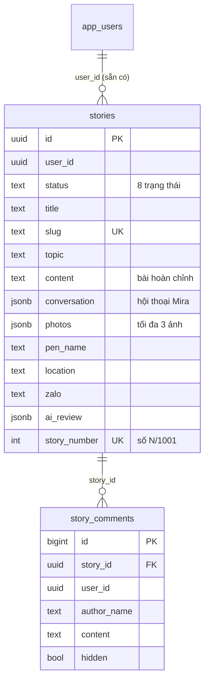

# Database — Luồng kể chuyện 1001 Câu chuyện cùng Guitar

> Thiết kế dữ liệu cho hành trình kể chuyện (xem `UX-FLOW-KE-CHUYEN.md`).
> File SQL thực thi: **`cs-rhythm-editor/db/story_setup.sql`** (idempotent,
> **chưa chạy** — Văn Anh chạy trong Supabase SQL Editor khi bắt đầu code).
>
> Nguyên tắc: dùng chung hạ tầng repo `cs-rhythm-editor` — Supabase
> project `wojmdilyflffvdtpovmq`, tài khoản = `app_users` sẵn có,
> RLS theo mô hình self_managed của `db/rls_setup.sql`.

------------------------------------------------------------------------

# 1. Tổng quan

Chỉ **2 bảng mới + 1 bucket** — không đụng bảng cũ nào:

Bucket Storage: **`story-photos`** (public đọc; upload theo thư mục
`{user_id}/...` của từng người).

------------------------------------------------------------------------

# 2. Bảng `stories` — một dòng = một câu chuyện

Quyết định thiết kế quan trọng:

1.  **Cả cuộc đời câu chuyện nằm trên MỘT dòng** — từ lúc mở lời với
    Mira đến lúc xuất bản. Không tách bảng "draft"/"session" riêng:
    -   `conversation` (jsonb) lưu hội thoại Mira → chính là **nháp tự
        lưu**: rời đi, đổi thiết bị, quay lại — Mira đọc lại và nhớ
        đã kể đến đâu (B2b của UX flow).
    -   `content` là bài Mira viết (B4) và người dùng sửa (B5).
    -   Một người có thể có nhiều câu chuyện (nhiều dòng).
2.  **`status` là cột trung tâm** — 7 trạng thái UX + 1 trạng thái
    giám sát:

    | status | Nhãn UX | Ai giữ bóng |
    |---|---|---|
    | `telling` | 🔥 Đang kể | Người dùng + Mira |
    | `collecting_photos` | 📷 Đang thu thập ảnh | Người dùng |
    | `writing` | ✍️ Mira đang viết | Mira |
    | `user_review` | 👀 Chờ bạn duyệt | Người dùng |
    | `submitted` | 🕊️ Đã gửi biên tập | AI biên tập |
    | `pending_publish` | ⏳ Chờ xuất bản | Hệ thống |
    | `published` | 🎉 Đã xuất bản #N | Cộng đồng |
    | `unpublished` | (bài đã gỡ) | Thầy — giám sát, hiếm dùng |

    Vòng lặp duyệt–sửa (B5 → B2 → B4 → B5) = quay lui giữa 4 trạng
    thái đầu — RLS cho phép vì đều thuộc nhóm "còn trong tay người kể".
3.  **`photos` là jsonb** (tối đa 3 ảnh `{url, caption}`) — không tách
    bảng ảnh riêng. Power of 1: 3 phần tử không cần bảng + join.
4.  **`story_number`** (#N/1001) và **`slug`** chỉ gán lúc xuất bản,
    bởi AI biên tập (Edge Function) — unique index bảo đảm không trùng.
5.  **`ai_review`** (jsonb) lưu kết quả AI biên tập:
    `{verdict: 'ok' | 'need_more' | 'escalate', notes, at}` — nhánh
    `escalate` là bài chuyển thầy xem tay (B7).
6.  `zalo` là kênh báo tin *tùy chọn* (app + email lấy từ tài khoản).

# 3. Bảng `story_comments` — bình luận trang chi tiết

Tối giản: nội dung + `author_name` chốt tại thời điểm viết +
cờ `hidden` để thầy ẩn khi giám sát. Tạo sẵn cùng script (UI bình luận
là hạng mục sau, không phải làm ngay).

------------------------------------------------------------------------

# 4. Phân quyền (RLS) — ai làm được gì

Hai bảng đều **self_managed** (đã thêm vào mảng trong
`db/rls_setup.sql` cùng đợt — chạy lại rls_setup không đè policy hẹp).

| Vai | `stories` | `story_comments` |
|---|---|---|
| anon (khách) | CHỈ đọc `published` | Đọc bình luận chưa ẩn của bài published |
| Học sinh (authenticated) | Đọc bài published + **mọi bài của MÌNH**; tạo/sửa/xoá bài của mình **khi chưa gửi biên tập**; bấm "Gửi" = tự chuyển `submitted` | Viết đứng tên mình; xoá của mình |
| AI biên tập (Edge Function, service role — vượt RLS) | `submitted → pending_publish → published`, gán `slug` + `story_number`, ghi `ai_review` | — |
| Thầy (`is_teacher()`) | Toàn quyền (giám sát: sửa/gỡ sau xuất bản) | Toàn quyền (ẩn/xoá) |

Chốt an toàn quan trọng: **người kể KHÔNG thể tự xuất bản** — policy
UPDATE của owner chỉ cho đi đến `submitted`; các bước sau thuộc service
role. Học sinh cũng **không sửa được bài của nhau** (khác policy rộng
mặc định của repo — đây là lý do phải self_managed).

Storage `story-photos`: public đọc (bài đã đăng cần ảnh công khai);
upload/sửa/xoá chỉ trong thư mục `{auth.uid()}/` của chính mình.

------------------------------------------------------------------------

# 5. Những gì CỐ TÌNH chưa làm (chờ Context thật)

-   **Bảng notifications riêng** — "mục sống trên app" đọc thẳng từ
    `stories.status` của user (badge khi có thay đổi); log gửi
    Zalo/email để giai đoạn thiết kế API (Edge Function) quyết.
-   **Bảng topics riêng** — 10 chủ đề đang là hằng số trong code
    landing; chỉ tách bảng khi cần quản trị chủ đề động.
-   **Like/reaction, view count** — không phải mạng xã hội (quyết định
    đã chốt số 2).
-   **Full-text search** — thư viện dưới ~100 bài chưa cần; thêm
    `tsvector` khi thật sự cần tìm kiếm.

------------------------------------------------------------------------

# 6. Việc cần làm khi triển khai (checklist cho phiên code)

1.  Văn Anh chạy `db/story_setup.sql` trong Supabase SQL Editor
    (idempotent, an toàn chạy lại).
2.  Kiểm tra nhanh: anon không SELECT được bài `telling`; học sinh A
    không UPDATE được bài của học sinh B; owner không set thẳng
    `status='published'` được.
3.  AI biên tập = Edge Function dùng **service role key** (đã có mô
    hình Edge Function của Mira tuyển sinh để tham chiếu).
4.  Nếu có ngày chạy lại `db/rls_setup.sql`: `stories`,
    `story_comments` đã nằm trong self_managed — không cần làm gì thêm.
